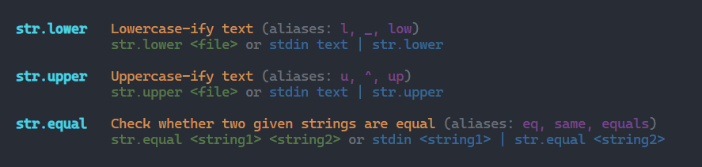

# str.sh

> [!WARNING]
> **This project is still in development with more features to come**

### Why?

I usually use the bash/zsh shell regularly and I made this tool because I was tired of using a billion `grep`, `wc`, `tr` and `sed` statements to perform basic string operations in the terminal.

With this tool, you can just do the following. Did I mention it's chainable?

```sh
echo "hello there" | str.upper | str.reverse | str.contains "OLLEH" # should echo "true"
```

Help command screenshot (still incomplete):


